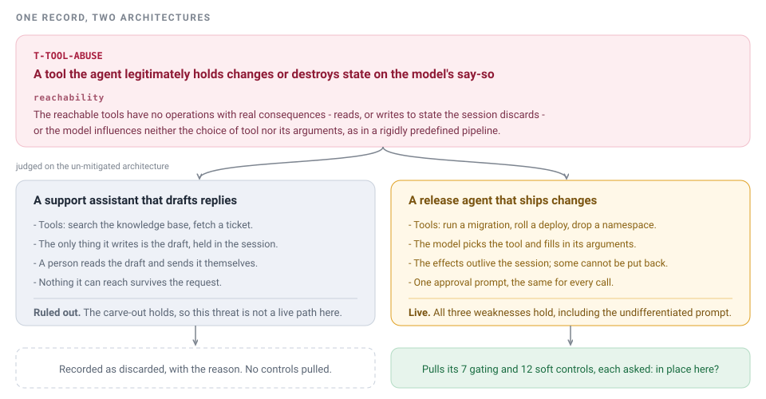
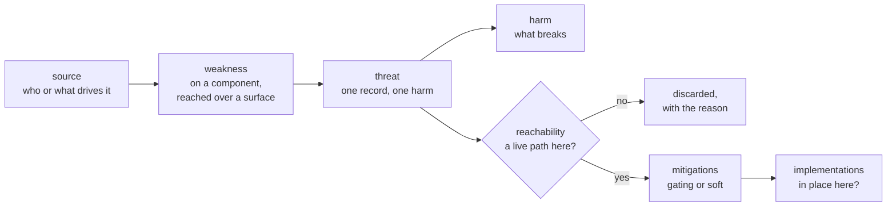
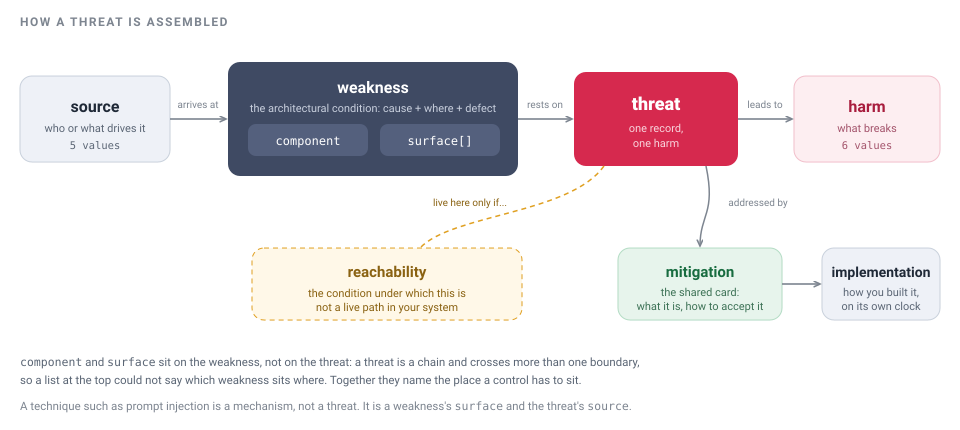
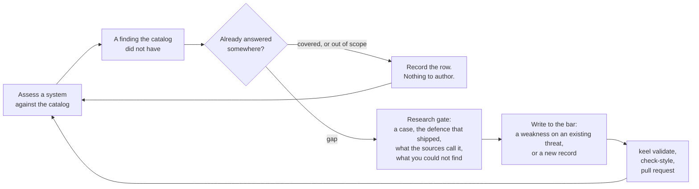
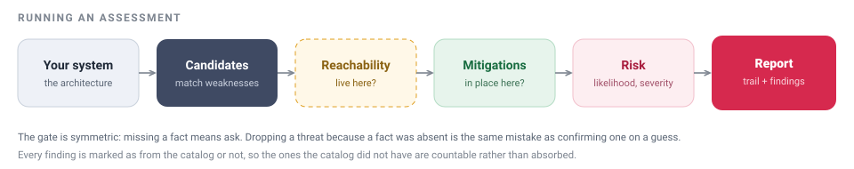
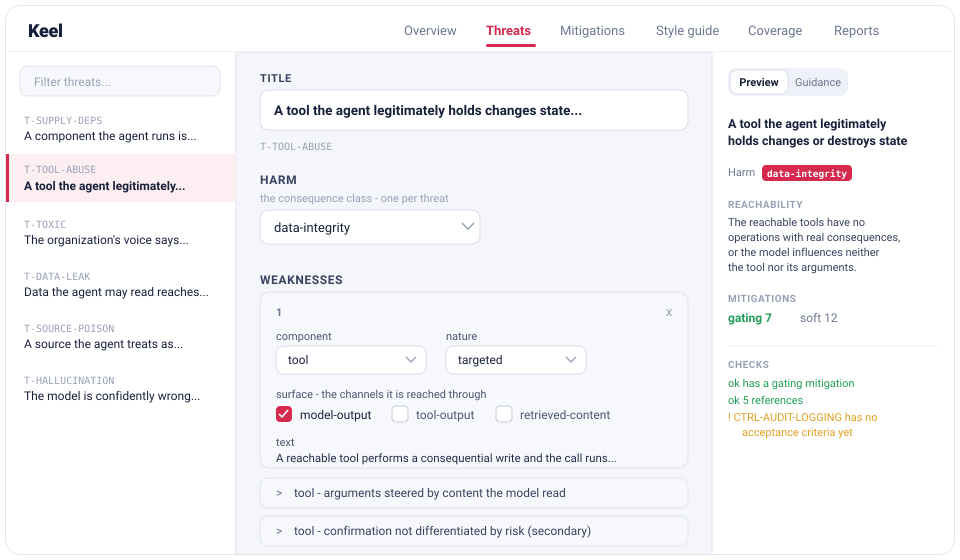

# Keel

**A threat model you run against your system and edit to fit it, without it turning into a dump.**

[](https://github.com/roselis-lab/keel/actions/workflows/ci.yml)
[](LICENSE)

A keel is the one load-bearing member that keeps a hull upright with the least material. Same idea here: the smallest structure that holds a GenAI threat model together and keeps an assessment on course.

## Two problems

**A threat model is an encyclopedia, not an engine.** It is read, not run. Nothing in it answers the only question that matters in front of a real system: is this reachable *here* at all?

**And it is someone else's encyclopedia.** OWASP did not write about your architecture. Taking it as it stands does not fit; editing it to fit turns it into your own encyclopedia within a quarter - just as dead, and now wrong as well.

The second problem is what makes the first hard. An engine over somebody's list is easy. What is hard is a list you can rewrite for yourself that does not rot while you do it.

Everything in Keel serves one of those two. Against the first: every threat carries a `reachability` condition and an assessor that walks it against a real architecture. Against the second: YAML in git that forks cleanly, a separate `implementations` layer so the shared card and your build move on different clocks, and a style guide plus a review skill so the fork stays editable by someone who was not there when it was written.

## What that looks like

Here is one record from the catalog, put in front of two systems.

<p align="center"></p>

`T-TOOL-ABUSE` is *a tool the agent legitimately holds changes or destroys state on the model's say-so*. Its `reachability` says when that is not a live path:

> The reachable tools have no operations with real consequences - reads, or writes to state the session discards - or the model influences neither the choice of tool nor its arguments, as in a rigidly predefined pipeline.

For the support assistant, both halves hold. Its tools read; the only thing it writes is a draft that a person then sends. The threat is discarded, and the assessment records why, so the next reviewer does not re-derive it.

For the release agent, neither half holds. It can run a migration and drop a namespace, the model chooses both the tool and the arguments, and the effects outlive the session. The threat stays live and pulls its 7 gating and 12 soft controls, each of which is then asked a second question: is it in place *in this deployment*, or only in the catalog?

That second question is what `implementations` exists for. The shared card defines the control and how to accept it; your implementation record says how you built it. A card with no implementation recorded here is a recommendation, and the assessor is told not to credit it as cover.

## The model

Four entities. A threat rests on one or more weaknesses at components you own, `reachability` says when the whole chain is dead in a given system, and mitigations attach to the threat with a strength.



One threat is one harm. The weaknesses are the paths to it. Two records exist only where ruling one out does not rule out the other, or closing one does not close the other - otherwise it is one threat with more weaknesses, and `keel validate` says so when two threats share a harm and the same gating controls.

A technique such as prompt injection is a mechanism, not a threat. It is a weakness's `surface` and the threat's `source`, and it shows up across many records rather than as one of its own.

<details>
<summary><b>The fields, and the frozen vocabularies</b></summary>

<p align="center"></p>

| Entity | Fields |
| --- | --- |
| **Threat** | `id`, `title`, `harm` (one, strict enum), `source[]`, `weaknesses[]`, `reachability`, `mitigations[]`, `references[]` (each with a `note` saying what the source supports), `positioning` (how this sits against the tracked sources), `tags[]` |
| **Weakness** (inside a threat) | `component` (which owned part it sits on), `surface[]` (the channels it is reached through; empty when the condition is about the component's own authority), `text` (cause + where + defect), `nature` (`targeted` or `secondary`) |
| **MitigationLink** (inside a threat) | `id`, `strength` (`gating` or `soft`), `rationale`, optional `exception` |
| **Mitigation** (card) | `id`, `name`, `mitigation_class`, `purpose`, `scope`, `out_of_scope`, `control_mechanism`, `failure_behavior`, `formal_implementation_risk`, `locus`, `telemetry`, `anti_patterns`, `validation`, `faq`, `positioning`, `requires[]`, `review`, `maintainer`, `implementations[]` (empty in the shared catalog) |

Every vocabulary is frozen in the Pydantic models and mirrored in `catalog/*.yaml`, so a value outside the list is a validation error, not a style opinion.

| Vocabulary | Values |
| --- | --- |
| `harm` - what breaks | `wrong-decision`, `data-integrity`, `data-exposed`, `code-execution`, `downtime`, `reputation-legal` |
| `source` - who or what drives it | `external-attacker`, `internal`, `hallucination`, `error`, `accident` |
| `surface` - the channel a component treats as trustworthy | `user-input`, `retrieved-content`, `tool-output`, `agent-message`, `memory`, `training-data`, `model-output` |
| `component` - where the weakness sits | `model`, `tool`, `downstream`, `memory`, `knowledge-base`, `identity-store` |
| `nature` | `targeted` (remove it and the attack fails), `secondary` (it only amplifies) |
| `strength` | `gating` (blocks the threat), `soft` (only lowers likelihood) |
| `mitigation_class` | `gating_control`, `detector`, `process`, `evidential_mitigation`, `corrective` |

`component` and `surface` sit on the weakness rather than on the threat. A threat is a chain and crosses more than one boundary, so a list at the top could not say which weakness sits where; together the two name the place a control has to sit.

</details>

## The loop

An assessment is not the end of the work. A finding the catalog did not have is marked as such, and that mark is what the next authoring pass is for.



Most of what arrives is already answered, so the loop starts by finding out. That step ends as a row in the coverage matrix, and a row is a real output - it is how the model can say what it deliberately does not cover without that reading as an omission.

When it is a genuine gap, the authoring skill will not let the writing start until the research is done. This is what it looks like when the gate holds:

```
> Fold this in: an agent's scheduled task keeps running under its own
> authority after the person who created it has lost access.

folding-into-the-model

Step 1 - what kind of thing is it, and is it already answered?
  search("standing authority after revocation")   -> T-CRED-THEFT (adjacent)
  search("scheduled agent task stale grant")      -> nothing that answers it
  get_coverage(source_id="owasp-agentic")         -> ASI03 covered by T-CRED-THEFT

  T-CRED-THEFT is a privileged action running under the agent's identity at
  someone else's request. This is the agent's own grant outliving the grantor.
  Different chain, different rule-out. Disposition: partial gap. Carry on.

Step 2 - the research gate (research.md)
  1. Name a case: where, what happened, what made it possible.   NOT FOUND
  2. Name the defence that was actually adopted.                 NOT FOUND
  3. What the tracked sources call it, in their words.           ASI03, read
  4. What you looked for and did not find.                       (below)

  Stopping here rather than writing. Searched the AI Incident Database, the
  ATLAS case studies attached to AML.T0053, and vendor advisories for agent
  schedulers. Everything I found is a list saying the risk exists. Writing the
  card now would produce something fluent that cites nothing, and the per-field
  review would pass it, because fluency is exactly what a card written from
  memory has.

  Two ways on, your call:
    a) keep looking, with terms you suggest
    b) write it as a weakness on T-CRED-THEFT with the absence recorded, so the
       card carries less weight and nobody repeats this search
```

The deterministic half runs on every change, locally and in CI. It checks what a reviewer should not have to: schema, frozen vocabularies, link integrity, id and filename agreement, and coverage rows that name a record no longer there.

```console
$ uv run keel validate
Warnings (353):
  ! CTRL-ACCESS-CONTROL: no scope
  ! CTRL-ACCESS-CONTROL: no out_of_scope
  ! CTRL-ACCESS-CONTROL: no locus
  ! CTRL-ACCESS-CONTROL: no failure_behavior
  ! CTRL-ACCESS-CONTROL: no validation: a control nobody can check is a recommendation
  ! CTRL-ARG-VALIDATION: no threat links this control
  ...
Catalog is valid.
```

Warnings never fail the build on their own, because an unfinished card is not a broken one. Errors do:

```console
$ uv run keel validate
Catalog invalid (1 problem(s)):
  - threat/T-TOOL-ABUSE: links 'CTRL-TOOL-ALLOWLISTS', which is not in the catalog
$ echo $?
1
```

`keel validate --strict` treats the 353 warnings as errors too, which is the switch to reach for once a fork has finished the cards it cares about.

What no rule can check is whether a sentence is any good. The rule registry deliberately holds nothing about the wording of a field: whether a `purpose` merely restates the name is semantics, it cannot be decided mechanically, and a rule that tried would only ever guess. That job belongs to the style guide and to the `check-style` skill, which judges an entry against the per-field bar and the record-level tests before the work is reported as done.

## Where the model stands

The catalog is a floor, not a claim to enumerate GenAI threats. These are the current numbers, and the parts that are not written yet are counted too, on the Overview screen and by `keel validate`.

**13 threats, 71 mitigations, 92 threat-to-mitigation links, 51 references.**

Coverage against four pinned releases. Every entry of a release gets a row whether or not Keel answers it, because a matrix built outwards from Keel's own content could never show what is missing.

| Source | Rows | Covered | Out of scope, with reasoning | Gap |
| --- | ---: | ---: | ---: | ---: |
| OWASP Top 10 for LLM Applications 2025 | 10 | 10 | 0 | 0 |
| OWASP Top 10 for Agentic Applications 2026 | 10 | 10 | 0 | 0 |
| MITRE ATLAS 5.6.0 | 101 | 68 | 22 | 11 |
| Google SAIF risk map | 15 | 9 | 4 | 2 |
| **Total** | **136** | **97** | **26** | **13** |

What is not done, stated rather than hidden:

- **280 mitigation card fields are unwritten** - `scope`, `out_of_scope`, `locus` and `failure_behavior` across 70 of the 71 cards.
- **70 controls have no acceptance criteria.** A control nobody can check is a recommendation, and the warning says so in those words.
- **11 weaknesses carry no reference**, because no public case exists for them. Mostly multi-agent paths and approval fatigue.
- **3 controls are linked from no threat.**

Saying it is the point. The loop above is what those counts are for.

<!-- SCREENSHOT: the Overview screen at http://localhost:8000/, showing the counts (threats, mitigations, links), style-guide coverage per entity, and the "gaps to review" list with its clickable chips. This is the screen the honest-numbers section is describing, so capture it with the real catalog loaded rather than a demo copy. -->

## Install

```bash
git clone https://github.com/roselis-lab/keel.git
cd keel
uv sync                # installs Keel; `pip install -e .` works too
uv run keel validate   # confirm the catalog loads
```

There is no database. Keel reads `catalog/*.yaml` into memory on start, and every write goes straight back to those files as a diff.

### Run it against a system

For the assessment path, point your agent at the repo's `.mcp.json`. It launches Keel over stdio and exposes the tools as `mcp__keel__*`; Claude Code picks it up automatically, so there is no server to start.

Then ask: *"Assess the GenAI security of \<describe your system\>."*

<p align="center"></p>

The `assess-genai-with-library` skill matches weaknesses against your architecture, applies each `reachability` carve-out on the un-mitigated system, and checks which linked controls have an implementation recorded. It writes a report to `reports/<system>/<date>.yaml` through the MCP tools, which check what a file write cannot - that the grades are on the allowed scale, and that every catalog id the report names exists.

The gate around all of this is symmetric. Missing a fact means ask. Dropping a threat because a fact was absent is the same mistake as confirming one on a guess.

A second assessment of the same system is a delta against the first, not a re-derivation.

### Browse and edit it

```bash
uv run uvicorn keel.main:app     # UI and REST at http://localhost:8000/
# or: docker compose up          # same UI; add --profile mcp for HTTP MCP on :8001
```

### Grow it

Edit through the MCP write tools, the UI, or the YAML by hand. Add what your stack needs, record how your org realizes a control in `implementations`, and prune what does not apply. Every change is a readable YAML diff.

```bash
git checkout -b add-scheduled-task-authority
git add catalog/
git commit -m "T-CRED-THEFT: weakness for a grant that outlives the grantor"
git push -u origin add-scheduled-task-authority
gh pr create --fill
```

CI runs `ruff`, `keel schema --check`, `keel validate` and `pytest` on every pull request. See [CONTRIBUTING.md](CONTRIBUTING.md) for what belongs in the shared catalog and what belongs in your fork.

## Why not OWASP, ATLAS or MAESTRO

Keel builds on all three and reuses their framing; the coverage matrix above is how it says so. They give you a shared language and stop there, which leaves both problems standing.

| | Against the first problem: is it reachable here? | Against the second: can I make it mine? |
| --- | --- | --- |
| **OWASP LLM Top 10** | A ranked list that mixes kinds: a mechanism (Prompt Injection, which becomes a threat only once it reaches a real asset through an agent's privileges), a consequence class (Sensitive Information Disclosure), generic software risk (Supply Chain), and a teaching trap (System Prompt Leakage treats the system prompt as a security boundary). Nothing in it decides applicability. | Prose, not records. There is no slot anywhere in it for your architecture, so adapting it means rewriting it. |
| **MITRE ATLAS** | Adversary-side and a catalogue rather than a procedure. It tells you what has been done to systems like yours; it cannot tell you whether any of it is reachable in yours. | Machine-readable and genuinely reusable, which is why all 101 of its entries are decided in the matrix above. It carries its own mitigations, but no slot for the one you actually built. |
| **CSA MAESTRO** | An architectural map you read, with no rule for deciding what applies to the system in front of you. Overkill for a single-agent, single-tool setup. | A methodology, so a fork is a document. |

Keel's answer to the first problem is `reachability` on every threat and an assessor that walks it, returning findings marked as from the catalog or not.

Its answer to the second is that the model is YAML in git, `implementations` is a layer of its own so the shared card and your build move on different clocks, and the style guide, the record-level rules and the review skill are what keep a fork from decaying. A model nobody can edit safely is one nobody edits.

It also separates what OWASP conflates: a mechanism becomes a finding only once it reaches a real asset. And it stays small, so a single-agent setup does not pay for a layered methodology.

## What is in the box

<details>
<summary><b>Skills</b></summary>

Under `.claude/skills/`, in two groups.

**Assessing a system**

- **`assessing-genai-security`** is the model-agnostic methodology: the data-sufficiency gate, the per-threat chain (source, surface, weakness, scenario, business impact, risk, delta) and the two-part output, an auditable analysis trail followed by the final assessment.
- **`assess-genai-with-library`** binds that methodology to Keel's MCP: candidate threats, the `reachability` match, then the linked mitigations and whether their `implementations` are actually in place. It finishes by polishing the final assessment through `tighten-text` and `humanizer`, both substance-preserving.

Every report carries a `meta` block recording how the run went - the questions that moved the analysis, the facts the specialist volunteered without being asked, and where they said the reasoning was wrong. That block exists to improve the assessor, so it is filled honestly, including the parts that do not flatter it.

**Working with the model**

- **`folding-into-the-model`** decides what kind of thing an incoming item is, whether the model already answers it, whether it is one record or part of one, and then writes to the bar. It shows its uncertainty rather than resolving it silently, and asks before changing what an existing entry means.
- **`check-style`** judges what was written against the style guide. It applies the bar and does not own it: if a field is wrong and the bar is silent, the fix is to the bar.

</details>

<details>
<summary><b>The UI</b></summary>

<p align="center"></p>

One static HTML file, no build step, served at `http://localhost:8000/`. Six screens: Overview, Threats, Mitigations, Style guide, Coverage and Reports.

The interface is review-first. The fastest way to author is to ask an LLM through the MCP tools; the UI writes files and points you at the file to commit, and it is not a git client. It carries full create, read, update and delete for threats and mitigations as a complete fallback.

**Overview** is the landing screen: counts, style-guide coverage per entity, and a "gaps to review" list with chips that jump straight to the record. Nothing here blocks anything.

**Threats** and **Mitigations** edit one record at a time in three panes - list, editor, live preview. The form is built from a JSON Schema generated from the Pydantic models, never hand-written, so the fields, their order and the dropdowns cannot drift from the code. Each field keeps one short hint; the full guidance lives in the right rail, which flips from Preview to Guidance when a field has focus, so it never pushes the form around. Every change is checked on the server: red blocking errors when the structure is wrong, amber advice that never blocks a save.

**Style guide** edits the authoring guidance itself, with a field tree derived from the model so the guidance cannot describe fields that no longer exist. Orphan guidance is flagged.

`keel schema` regenerates the files under `schema/`, and `keel schema --check` fails when they are stale. CI runs it as a gate.

</details>

<details>
<summary><b>Interfaces</b></summary>

- **MCP** (primary): `stdio` for local Claude Code, `--http` for remote clients. Threats and their mitigation links, mitigations, the style guide, coverage rows, search across everything, reports, and library health.
- **REST**: reads and writes over `/threats`, `/mitigations`, `/style-guide`, `/coverage`, `/reports`, `/search`, `/schema/{entity}`, `/rules`, `/vocabulary`, `/health`, plus `POST /threats/validate` behind the editor. The MCP tools and the REST writes share one service layer, so every edit lands in `catalog/*.yaml`.

</details>

<details>
<summary><b>Roadmap</b></summary>

Per-system state to mark a threat not applicable for a given deployment, or to accept a risk, so known noise can be suppressed without deleting shared knowledge. Until then, that context is expressed by editing or pruning your fork.

</details>

## Development

Two checks, for two different things.

- **`uv run keel validate`** checks the catalog content: schema, frozen vocabularies, link integrity, id and filename agreement, coverage claims, plus the advisory tier.
- **`uv run pytest`** is the code test suite, for anyone modifying Keel itself.

```bash
uv sync --extra dev
uv run ruff check .
uv run keel validate
uv run pytest
```

## License

Keel is licensed under the [Apache License 2.0](LICENSE), covering the code, the catalog, the skills and the docs. Attribution is requested when reusing the catalog or the methodology. See [NOTICE](NOTICE).

The bundled `humanizer` skill is third-party work by Siqi Chen under the MIT License.
