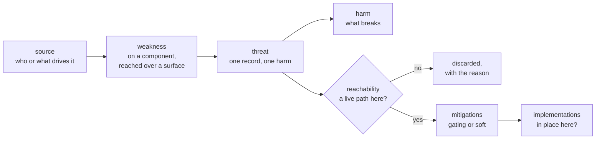
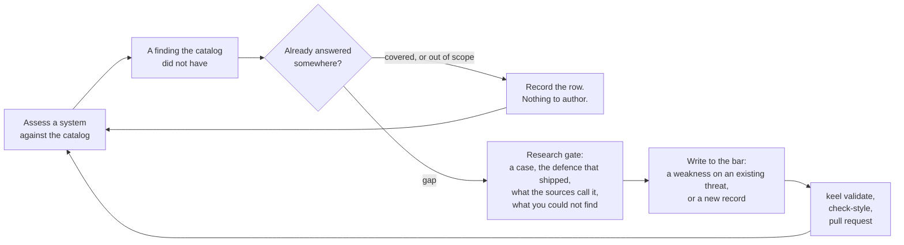

# Keel

**A threat model you run against your system and edit to fit it, without it turning into a dump.**

[](https://github.com/roselis-lab/keel/actions/workflows/ci.yml)
[](LICENSE)

A keel is the one load-bearing member that keeps a hull upright with the least material. Same idea here: the smallest structure that holds a GenAI threat model together and keeps an assessment on course.

## Two problems

**A threat model is an encyclopedia, not an engine.** It is read, not run. Nothing in it answers the only question that matters in front of a real system: is this reachable *here* at all?

**And it is someone else's encyclopedia.** OWASP did not write about your architecture. Taking it as it stands does not fit; editing it to fit turns it into your own encyclopedia within a quarter - just as dead, and now wrong as well.

The second problem is what makes the first hard. An engine over somebody's list is easy. What is hard is a list you can rewrite for yourself that does not rot while you do it.

Everything in Keel serves one of those two, and everything below is one of the two answers.

## The model

Four entities, and the chain runs one way.



A **weakness** is an architectural condition on a **component** you own, reached over a **surface**, which is the channel that component treats as trustworthy. A **threat** rests on one or more weaknesses, is driven by a **source**, and lands as exactly one **harm**. **Mitigations** hang off the threat, each graded `gating` (blocks it) or `soft` (only lowers the odds, and the link says so in writing).

One threat is one harm, and the weaknesses are the paths to it. Two records exist only where ruling one out does not rule the other out. Several paths to the same harm, closed by several different controls, are still one threat.

A technique such as prompt injection is a mechanism rather than a threat. It is a weakness's `surface` and a threat's `source`, and it turns up across many records instead of becoming one.

[Every field and the frozen vocabularies](docs/model.md).

Which leaves the field that does the work, and it gets a section of its own.

## The first answer: every threat says when it does not apply

Here is one record from the catalog, put in front of two systems.

<p align="center"></p>

`T-TOOL-ABUSE` is *a tool the agent legitimately holds changes or destroys state on the model's say-so*. Its `reachability` says when that is not a live path:

> The reachable tools have no operations with real consequences - reads, or writes to state the session discards - or the model influences neither the choice of tool nor its arguments, as in a rigidly predefined pipeline.

For the support assistant, both halves hold. Its tools read; the only thing it writes is a draft that a person then sends. The threat is discarded, and the assessment records why, so the next reviewer does not re-derive it.

For the release agent, neither half holds. It can run a migration and drop a namespace, the model chooses both the tool and the arguments, and the effects outlive the session. The threat stays live and pulls its 7 gating and 12 soft controls, each of which is then asked a second question: is it in place *in this deployment*, or only in the catalog?

Every threat in the catalog carries a sentence like that, written against the system with no controls on it. That sentence is the difference between reading a list and running it.

## The second answer: it is your copy, and a change to it is a pull request

The model is YAML in git. There is no database. Every write, from the UI or the MCP tools or your editor, lands in `catalog/*.yaml` as a readable diff.

```bash
git checkout -b add-scheduled-task-authority
git add catalog/
git commit -m "T-CRED-THEFT: weakness for a grant that outlives the grantor"
gh pr create --fill
```

So a threat model gets reviewed the way code does: someone proposes a change, someone else reads the diff and argues with it, CI runs, it merges, and the next assessment in your organisation already uses it. That is the whole of what "the model is yours" means, and it is why the format is files rather than a product with an admin panel.

The part of the model that makes this survive a fork is `implementations`, which is a layer of its own. The shared card defines a control and how to accept it; your implementation record says how you actually built it. The two move on different clocks, so taking an upstream change does not collide with your build, and a card with no implementation recorded is treated as a recommendation rather than as cover.

## The loop

An assessment is not the end of the work. A finding the catalog did not have is marked as such, and that mark is what the next authoring pass is for.



Most of what arrives is already answered, so the loop starts by finding out. That step ends as a row in the coverage matrix, and a row is a real output: it is how the model says what it deliberately does not cover without that reading as an omission.

When it is a genuine gap, the authoring skill will not let the writing start until the research is done. It has stopped the author mid-card more than once. [How the gate holds, with a worked example](docs/authoring.md).

## Where the model stands

The catalog is a floor, not a claim to enumerate GenAI threats. The parts that are not written yet are counted too.

**13 threats, 71 mitigations, 92 threat-to-mitigation links, 51 references.**

**136 rows** of coverage against four pinned releases - OWASP LLM Top 10 2025, OWASP Agentic Top 10 2026, MITRE ATLAS 5.6.0 and the Google SAIF risk map - of which **97 covered, 26 out of scope with the reasoning, 13 gaps**. Both OWASP lists are fully answered. Every entry of a release gets a row whether or not Keel answers it, because a matrix built outwards from Keel's own content could never show what is missing. [The full table](docs/comparison.md#coverage).

What is not done, stated rather than hidden:

- **280 mitigation card fields are unwritten** - `scope`, `out_of_scope`, `locus` and `failure_behavior` across 70 of the 71 cards.
- **70 controls have no acceptance criteria.** A control nobody can check is a recommendation, and the warning says so in those words.
- **11 weaknesses carry no reference**, because no public case exists for them. Mostly multi-agent paths and approval fatigue.
- **3 controls are linked from no threat.**

Saying it is the point. The loop above is what those counts are for.

## Install

```bash
git clone https://github.com/roselis-lab/keel.git
cd keel
uv sync                # installs Keel; `pip install -e .` works too
uv run keel validate   # confirm the catalog loads
```

### Run it against a system

Point your agent at the repo's `.mcp.json`. It launches Keel over stdio and exposes the tools as `mcp__keel__*`; Claude Code picks it up automatically, so there is no server to start.

Then ask: *"Assess the GenAI security of \<describe your system\>."*

<p align="center"></p>

The `assess-genai-with-library` skill matches weaknesses against your architecture, applies each `reachability` condition to the un-mitigated system, and checks which linked controls have an implementation recorded. It writes a report to `reports/<system>/<date>.yaml` through the MCP tools, which check what a file write cannot: that grades are on the allowed scale, and that every catalog id the report names exists.

The gate around all of this is symmetric. Missing a fact means ask. Dropping a threat because a fact was absent is the same mistake as confirming one on a guess.

A second assessment of the same system is a delta against the first, not a re-derivation.

### Browse and edit it

```bash
uv run uvicorn keel.main:app     # UI and REST at http://localhost:8000/
# or: docker compose up          # same UI; add --profile mcp for HTTP MCP on :8001
```

One static HTML file, no build step, six screens. The fastest way to author is to ask an LLM through the MCP tools; the UI is review-first and carries full create, read, update and delete as a fallback.

### Grow it

Edit through the MCP write tools, the UI, or the YAML by hand. Add what your stack needs, record how your organisation realises a control in `implementations`, and prune what does not apply.

CI runs `ruff`, `keel schema --check`, `keel validate` and `pytest` on every pull request. See [CONTRIBUTING.md](CONTRIBUTING.md) for what belongs in the shared catalog and what belongs in your fork.

## Documentation

- [The model](docs/model.md) - the four entities, every field, and the frozen vocabularies.
- [Authoring](docs/authoring.md) - the research gate, the three layers of checking, and what no rule can decide.
- [Against OWASP, ATLAS and MAESTRO](docs/comparison.md) - what Keel takes from each, and the coverage table.
- [Skills, UI and interfaces](docs/interfaces.md) - what ships in the box.

## Development

Two checks, for two different things.

- **`uv run keel validate`** checks the catalog content: schema, frozen vocabularies, link integrity, id and filename agreement, coverage claims, plus the advisory tier.
- **`uv run pytest`** is the code test suite, for anyone modifying Keel itself.

```bash
uv sync --extra dev
uv run ruff check .
uv run keel validate
uv run pytest
```

## License

Keel is licensed under the [Apache License 2.0](LICENSE), covering the code, the catalog, the skills and the docs. Attribution is requested when reusing the catalog or the methodology. See [NOTICE](NOTICE).

The bundled `humanizer` skill is third-party work by Siqi Chen under the MIT License.
