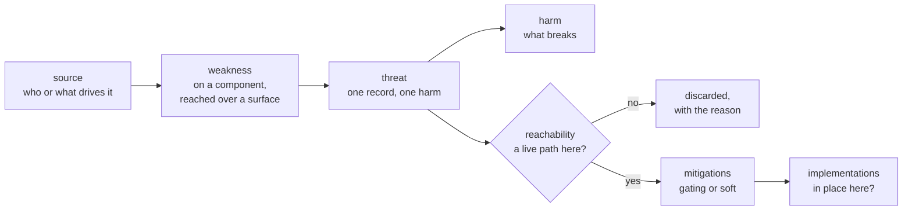

# The model

Four entities. A threat rests on one or more weaknesses at components you own, `reachability` says when the whole chain is dead in a given system, and mitigations attach to the threat with a strength.

## One threat is one harm

The weaknesses are the paths to it.

Two records exist only where ruling one out does not rule the other out. If a single honest `reachability` sentence kills both, it is one threat with more weaknesses, however many different controls it takes to close. `keel validate` raises a merge candidate when two threats share a harm and the same gating controls.

The test is about ruling out, not about closing. Several paths to one harm, closed by several different controls, are still one threat; splitting on which control happens to close which path produces records that cannot be judged against a system.

Check what you are splitting on. A field value is not an axis: two records that differ only in their `source` are one record with two sources.

A technique such as prompt injection is a mechanism, not a threat. It is a weakness's `surface` and the threat's `source`, and it shows up across many records rather than as one of its own.

## The fields

| Entity | Fields |
| --- | --- |
| **Threat** | `id`, `title`, `harm` (one, strict enum), `source[]`, `weaknesses[]`, `reachability`, `mitigations[]`, `references[]` (each with a `note` saying what the source supports), `positioning` (how this sits against the tracked sources), `tags[]` |
| **Weakness** (inside a threat) | `component` (which owned part it sits on), `surface[]` (the channels it is reached through; empty when the condition is about the component's own authority), `text` (cause + where + defect), `nature` (`targeted` or `secondary`) |
| **MitigationLink** (inside a threat) | `id`, `strength` (`gating` or `soft`), `rationale`, optional `exception` |
| **Mitigation** (card) | `id`, `name`, `mitigation_class`, `purpose`, `scope`, `out_of_scope`, `control_mechanism`, `failure_behavior`, `formal_implementation_risk`, `locus`, `telemetry`, `anti_patterns`, `validation`, `faq`, `positioning`, `requires[]`, `review`, `maintainer`, `implementations[]` (empty in the shared catalog) |

`component` and `surface` sit on the weakness rather than on the threat. A threat is a chain and crosses more than one boundary, so a list at the top could not say which weakness sits where; together the two name the place a control has to sit.

## The frozen vocabularies

Every vocabulary is frozen in the Pydantic models and mirrored in `catalog/*.yaml`, so a value outside the list is a validation error, not a style opinion.

| Vocabulary | Values |
| --- | --- |
| `harm` - what breaks | `wrong-decision`, `data-integrity`, `data-exposed`, `code-execution`, `downtime`, `reputation-legal` |
| `source` - who or what drives it | `external-attacker`, `internal`, `hallucination`, `error`, `accident` |
| `surface` - the channel a component treats as trustworthy | `user-input`, `retrieved-content`, `tool-output`, `agent-message`, `memory`, `training-data`, `model-output` |
| `component` - where the weakness sits | `model`, `tool`, `downstream`, `memory`, `knowledge-base`, `identity-store` |
| `nature` | `targeted` (remove it and the attack fails), `secondary` (it only amplifies) |
| `strength` | `gating` (blocks the threat), `soft` (only lowers likelihood) |
| `mitigation_class` | `gating_control`, `detector`, `process`, `evidential_mitigation`, `corrective` |

`GET /vocabulary` and the `get_vocabulary` MCP tool return these at runtime. Read them from there rather than from this page, which is a description and not the source.
